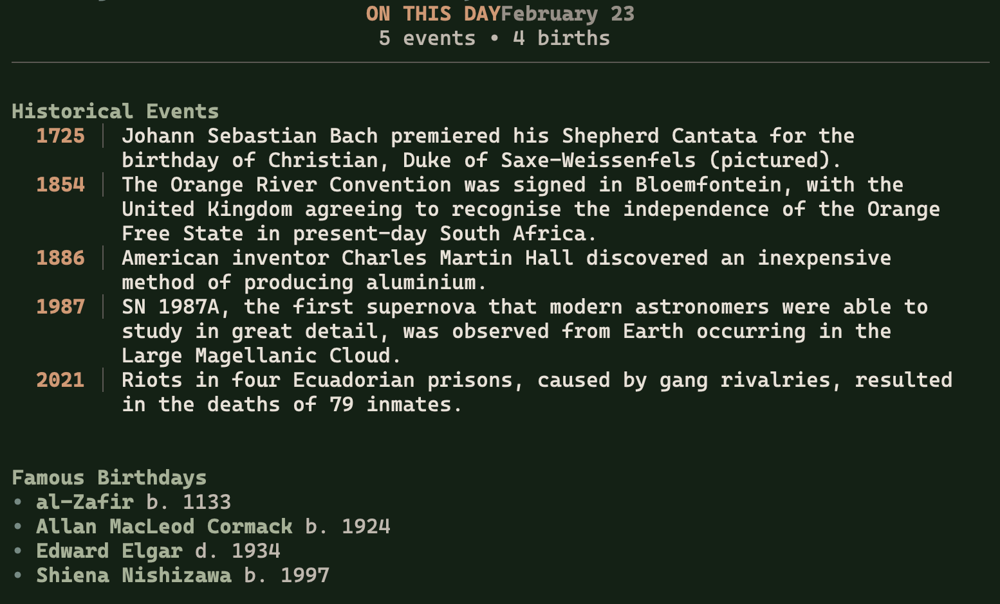

# otd-cli

On This Day is a compact TUI and headless CLI that prints notable historical events and famous birthdays for the current date. It is designed to feel calm and readable at terminal startup (e.g., in shell configs, similar to fastfetch).



## Features

- Curated, compact output (defaults to 6 events and 6 birthdays)
- TUI with smooth scrolling and subtle styling
- Headless mode for shell startup use
- Data sourced from Wikipedia's "On this day" page

## Requirements

- Go 1.24+
- Network access to Wikipedia

## Install

### From source

```sh
go build -o otd-cli .
```

### Run without installing

```sh
go run .
```

## Usage

### TUI mode (interactive)

```sh
./otd-cli
```

Controls:

- `j` / `k`: scroll
- `q` or `esc`: quit

### Headless mode (print and exit)

```sh
./otd-cli --headless
```

This is ideal for shell startup. Example for `~/.zshrc`:

```sh
otd-cli --headless
```

If you want the output width to match your terminal, ensure `COLUMNS` is set by your shell. The app falls back to 80 columns when `COLUMNS` is unset.

## How it works

- The scraper fetches `https://en.wikipedia.org/wiki/Wikipedia:On_this_day/Today`.
- It parses the current date, the first events list, and the birthdays list.
- The renderer formats a compact, readable view for both TUI and headless output.

## Project structure

- `main.go`: CLI entrypoint, headless flag handling
- `tui/model.go`: Bubble Tea model and rendering
- `tui/styles.go`: Lip Gloss styles
- `scraper/scraper.go`: Wikipedia scraper and data model

## Development

### Build

```sh
go build ./...
```

### Run TUI

```sh
go run .
```

### Run headless

```sh
go run . --headless
```

### Testing

No automated tests are currently included. If you add tests, keep them fast and network-safe; consider mocking HTTP calls in the scraper.

## Data source and etiquette

The app uses a Wikipedia page that is updated daily. Please avoid excessive polling. The request sets a descriptive User-Agent:
`otd-cli/1.0 (https://github.com/gabezeck/otd-cli; me@gabezeck.com)`

## Troubleshooting

### "could not open a new TTY"

Bubble Tea requires a real TTY. Use headless mode when running in non-interactive environments:

```sh
./otd-cli --headless
```

### No output or empty sections

Wikipedia markup occasionally changes. If parsing breaks, inspect `scraper/scraper.go` for selectors and update as needed.

## License

Add your license here.
